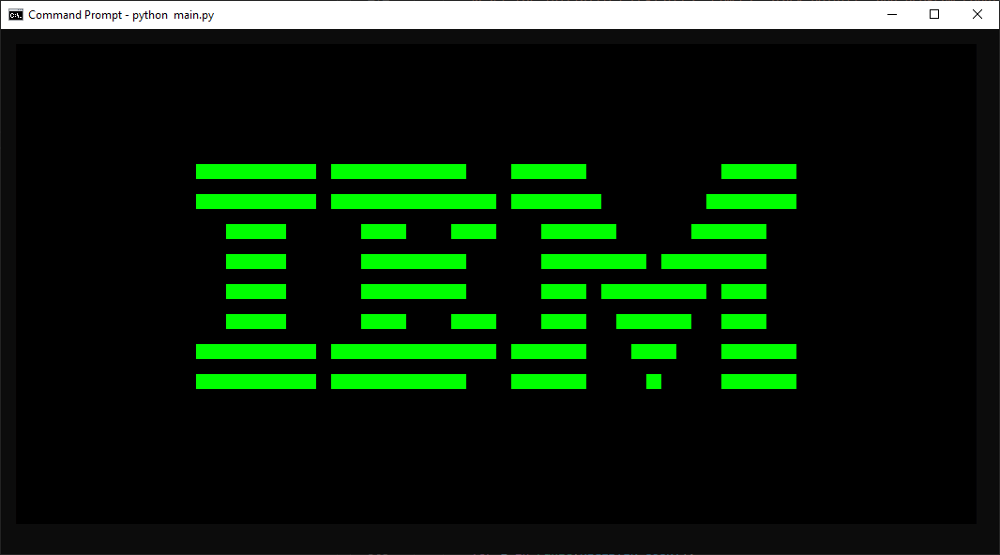
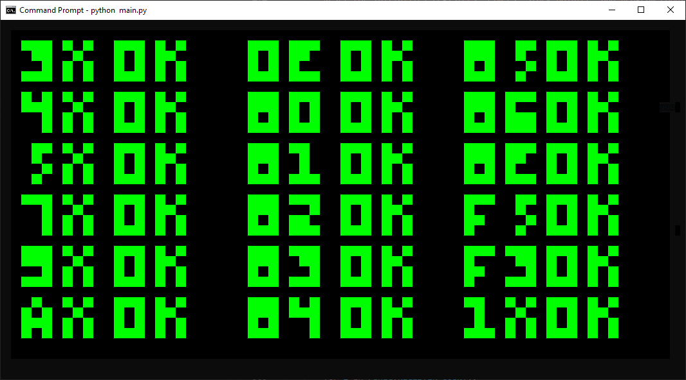
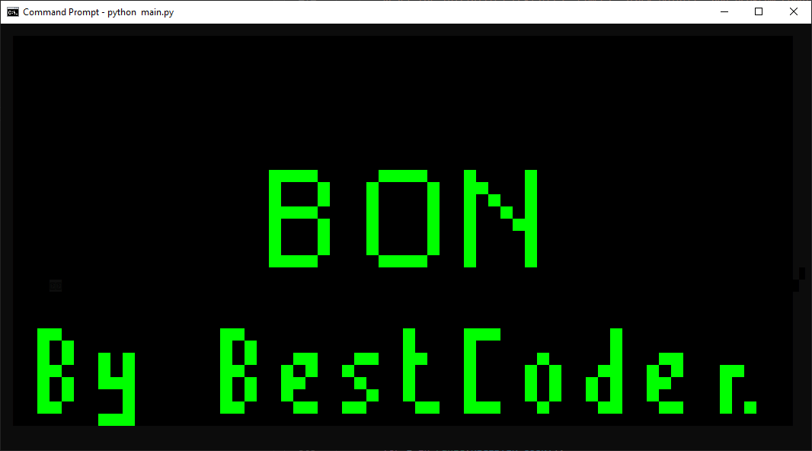

# ChipPy8

A terminal CHIP-8 emulator written in Python.

## About

ChipPy8 is a terminal emulator (more accurately, interpreter) for the [CHIP-8 programming language](https://en.wikipedia.org/wiki/CHIP-8).

Graphics are drawn to the console using ANSI escape codes. Make sure to use a platform with good color support.

## Installation

Clone the repository:

```sh
git clone git@github.com:ty-porter/ChipPy8.git
```

Install dependencies:

```
pip install -r requirements.txt
```

## Usage

_**NOTE:** You'll need to acquire a CHIP-8 ROM before using ChipPy8. No ROM files are included in this repository._

```sh
python chippy8.py PATH/TO/ROM.ch8
```

For instance, using the `test_opcode.ch8` test ROM in a `roms` directory:

```sh
python chippy8.py roms/test_opcode.ch8
```

## Controls

```
ORIGINAL                EMULATED
-----------------       -----------------
| 1 | 2 | 3 | C |       | 1 | 2 | 3 | 4 |
| 4 | 5 | 6 | D |  --\  | Q | W | E | R |
| 7 | 8 | 9 | E |  --/  | A | S | D | F |
| A | 0 | B | F |       | Z | X | C | V |
-----------------       -----------------
```

## Customization

There is a configuration file located at `chippy8/config.py`. You can edit the emulator configuration there.

```python
MAX_MEM0RY            = 0x1000 # 4096
PROGRAM_COUNTER_START = 0x200
REGISTER_COUNT        = 0x10   # 16
STACK_POINTER_START   = 0x52

DELAY_TIME_MS         = 0.0
FONT_FILE             = os.path.join('chippy8', 'chippy8.font')

PIXEL_COLORS = {
    0x00: (  0,   0,   0), # BLACK (off)
    0x01: (  0, 255,   0)  # GREEN (on)
}

KEY_MAPPING = {
    # First Row
    0x1: KeyCode.from_char('1'),
    0x2: KeyCode.from_char('2'),
    0x3: KeyCode.from_char('3'),
    0xC: KeyCode.from_char('4'),

    # Second Row
    0x4: KeyCode.from_char('Q'),
    0x5: KeyCode.from_char('W'),
    0x6: KeyCode.from_char('E'),
    0xD: KeyCode.from_char('R'),

    # Third Row
    0x7: KeyCode.from_char('A'),
    0x8: KeyCode.from_char('S'),
    0x9: KeyCode.from_char('D'),
    0xE: KeyCode.from_char('F'),

    # Fourth Row
    0xA: KeyCode.from_char('Z'),
    0x0: KeyCode.from_char('X'),
    0xB: KeyCode.from_char('C'),
    0xF: KeyCode.from_char('V')
}
```

## Screenshots

IBM Logo


test_opcode.ch8 PASS


bc_test.ch8 PASS


